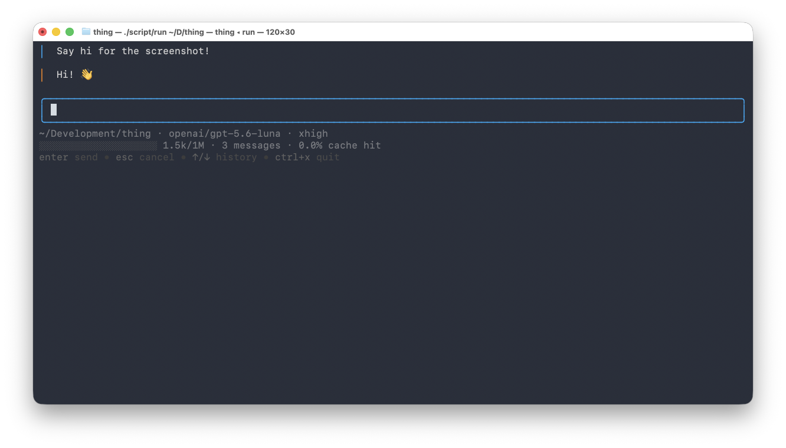

# 🖐 thing

**An agent harness built from first principles**

  

---

## 🧭 Why this exists

`thing` began as a question: how does an agent harness actually work? Rather than trust
a framework's magic, I hand-wrote just enough code to make a single API request, then
let the harness pull itself up by its own bootstraps. The working prototype gained the
`bash` tool by having its human-in-the-loop upload its own source code, fed back in
base64-encoded chunks. Once it could see and edit its own code, I started adding the
features I enjoy from other harnesses, borrowing most heavily from [Pi](https://pi.dev),
which I use every day.

No vibe-coding. The whole point is to understand how agent loops work. A model may help
guide its own evolution, but nothing ever lands blindly.

## 📚 The paper trail

The `docs/adr/` directory records *why* decisions were made. If you want to understand
the trade-offs, that's where to look.
